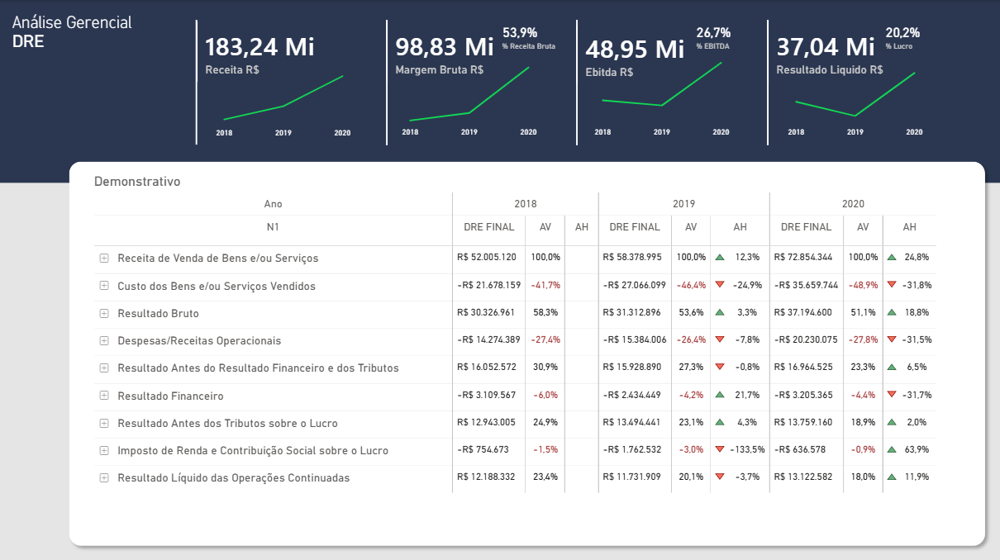
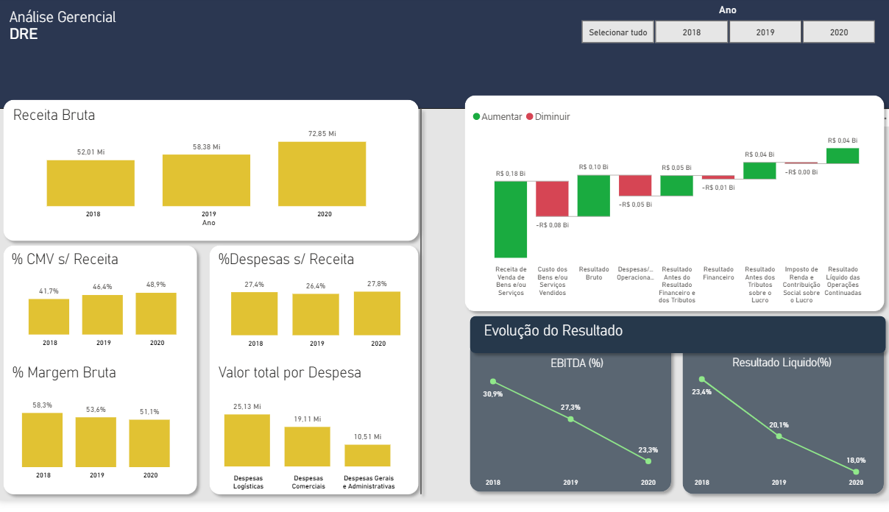

## Análise DRE AMBEV
Projeto de análise financeira completo, cobrindo o fluxo de ponta a ponta: da extração de dados em PDFs públicos até a construção de um dashboard gerencial interativo em Power BI.

---

## Objetivo

Transformar os dados da Demonstração do Resultado do Exercício (DRE) da AMBEV S.A., disponíveis publicamente na CVM, em um painel analítico que permita acompanhar a evolução financeira da companhia entre 2018 e 2020, com foco em margens, EBITDA e resultado líquido.

---

## Dashboard

### Tela 1 — Visão Gerencial e Demonstrativo


### Tela 2 — Análise de Margens e Evolução de Resultado


---

## Estrutura do Projeto

```
analise-dre-ambev/
│
├── data/
│   └── raw/                    PDFs originais extraídos da CVM
│
├── notebooks/
│   └── extracao_dre.ipynb      Extração e tratamento dos dados com Python
│
├── powerbi/
│   └── dashboard_dre.pbix      Arquivo Power BI com modelo e dashboard
│
├── docs/
│   └── documentacao.pdf        Documentação técnica completa do projeto
│
├── images/
│   ├── dashboard_tela1.png
│   └── dashboard_tela2.png
│
└── README.md
```

---

## Tecnologias Utilizadas

| Ferramenta | Finalidade |
|---|---|
| Python | Extração e tratamento dos dados dos PDFs |
| pdfplumber | Leitura e parsing das páginas dos relatórios |
| pandas | Manipulação e estruturação dos dados |
| Power BI | Modelagem dimensional e visualização |
| DAX | Criação de métricas e KPIs analíticos |
| Power Query | Transformação e carga dos dados no modelo |

---

##  Etapas do Projeto

### 1. Extração de Dados
Coleta dos relatórios anuais da AMBEV em formato PDF diretamente do portal da CVM. Desenvolvimento de script em Python com `pdfplumber` para extração, limpeza e padronização dos dados, tratando variações de formatação entre os arquivos de cada ano.

### 2. Modelagem e Estrutura Analítica
Construção do modelo dimensional no Power BI seguindo o padrão **Kimball Star Schema**, com três tabelas:
- `f_LancamentoDRE` — tabela fato com os valores financeiros
- `d_PlanoContas` — dimensão com a estrutura de contas da DRE
- `dCalendario` — dimensão de tempo para análises por período

### 3. Definição de Indicadores e Métricas (DAX)
Desenvolvimento de medidas para os principais KPIs financeiros:
- **Receita Bruta** e variação anual (AH%)
- **Margem Bruta** (AV% e evolução)
- **EBITDA** e percentual sobre receita
- **Resultado Líquido** e margem líquida
- Análise Horizontal (AH) e Análise Vertical (AV) para todas as linhas da DRE

### 4. Visualização e Dashboard
Construção de duas telas complementares:
- **Tela 1:** KPI cards com sparklines, demonstrativo completo da DRE com AV% e AH%
- **Tela 2:** Análise de margens por ano, waterfall de resultado, evolução de EBITDA e Resultado Líquido

### 5. Análise e Insights
- Receita cresceu **40% entre 2018 e 2020** (de R$ 52Mi para R$ 72,85Mi)
- Margem Bruta apresentou compressão gradual: de **58,3% para 51,1%**
- EBITDA reduziu de **30,9% para 23,3%**, sinalizando crescimento de custos acima da receita
- Resultado Líquido manteve crescimento absoluto apesar da compressão de margens

---

## Principais KPIs Analisados

| Indicador | 2018 | 2019 | 2020 |
|---|---|---|---|
| Receita Bruta | R$ 52,01 Mi | R$ 58,38 Mi | R$ 72,85 Mi |
| Margem Bruta | 58,3% | 53,6% | 51,1% |
| EBITDA % | 30,9% | 27,3% | 23,3% |
| Resultado Líquido % | 23,4% | 20,1% | 18,0% |

---

## Aprendizados

- Tratamento de PDFs com estruturas variáveis entre anos — parsing robusto com validação de padrões
- Modelagem dimensional aplicada a dados financeiros contábeis
- Construção de análises AV/AH em DAX com contexto de filtro por período
- Boas práticas de organização de modelo no Power BI para escalabilidade

---

## Documentação

A documentação técnica completa do projeto está disponível em [`docs/documentacao.pdf`](docs/documentacao.pdf), cobrindo decisões de modelagem, regras de negócio e dicionário de dados.

---

## Autor

**João Vitor Kuhn Conte**
Analytics & Business Intelligence | Performance | SQL · Power BI · Python

[](https://www.linkedin.com/in/joão-conte)
